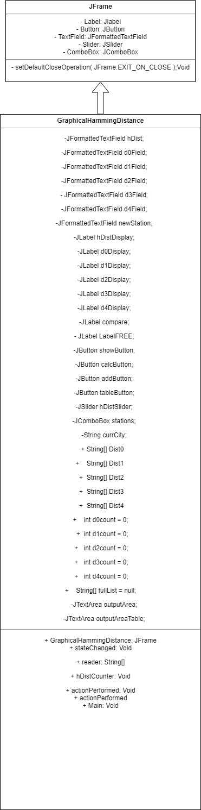

# Project 5

Project 5 has us continue working with the Mesonet.Txt files, where we find multiple stations within multiple haming distances, find the exact number of stations within each Hamming distance, add stations to this list and finally I chose to create a table with one station within 1 Hamming Distance, 2 within 2, 3 within 3 and 4 within 4.

## Slider tool

This tool was paired with a Formatted text tool, so that the user could slide it up and down to select how similar to their target station they were looking. The exact value was then displayed on the bar. After clicking on "Show Station" it would display the names of all of the stations within that range. 

## Compare With Tool

The compare with tool had the drop down box that was a list of all of the stations avaliable. This dropdown box dictated the station that all of the rest of the fields were testing against. After clicking on Calculate HD the program would calculate the hamming distance of each station, count them and then display them in their appropriate box.

## Add Station tool

This tool would take a 4 letter input from the user and then add that into the list of stations, while updating the length of the stations list. I was able to have it mostly keep the user from doubling up on the same station.

## Free Zone

I chose to create a table which would update with 1 station within 1 hamming distance, 2 within 2, 3 within 3 and 4 within 4. I also attempted to have it display as a seperate frame, but when I was doing that I somehow broke it so that it no longer diplayed the relevent stations, only the distances, and the frame pops up empty. I did a LOT of troubleshooting to try to figure out where I went wrong but I was unable to find the solution.

## UML

